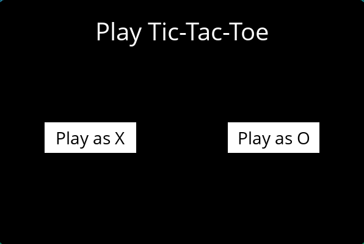
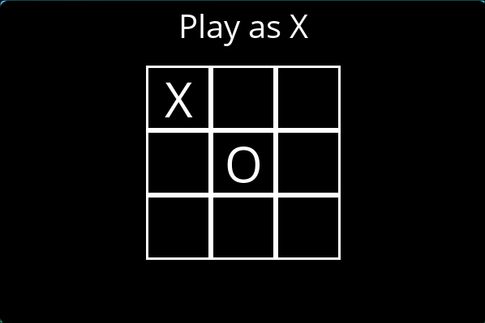
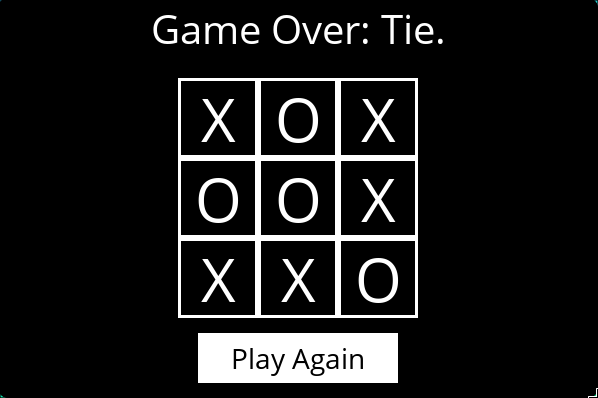

# Tic-Tac-Toe
A classic tic tac toe game to play with AI. The AI is implement using Minimax Algorithm
## Preview
Game menu to choose X or O:

Game play:

When the game end, you can decide to try again:

## How to run
Once in the directory for the project, run `pip3 install -r requirements.txt` to install the required Python package (pygame) for this project.
Please run `python runner.py` to start the game.
## How to play
If you don't know how to play tic tac toe, please take a look at this guide: [Tic Tac Toe gameplay](https://en.wikipedia.org/wiki/Tic-tac-toe#Gameplay)
